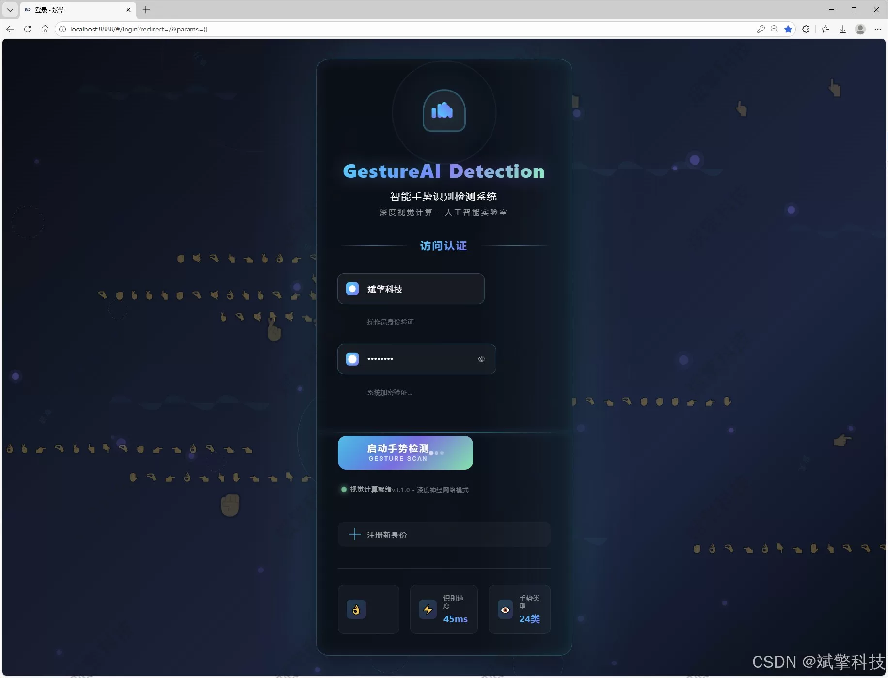
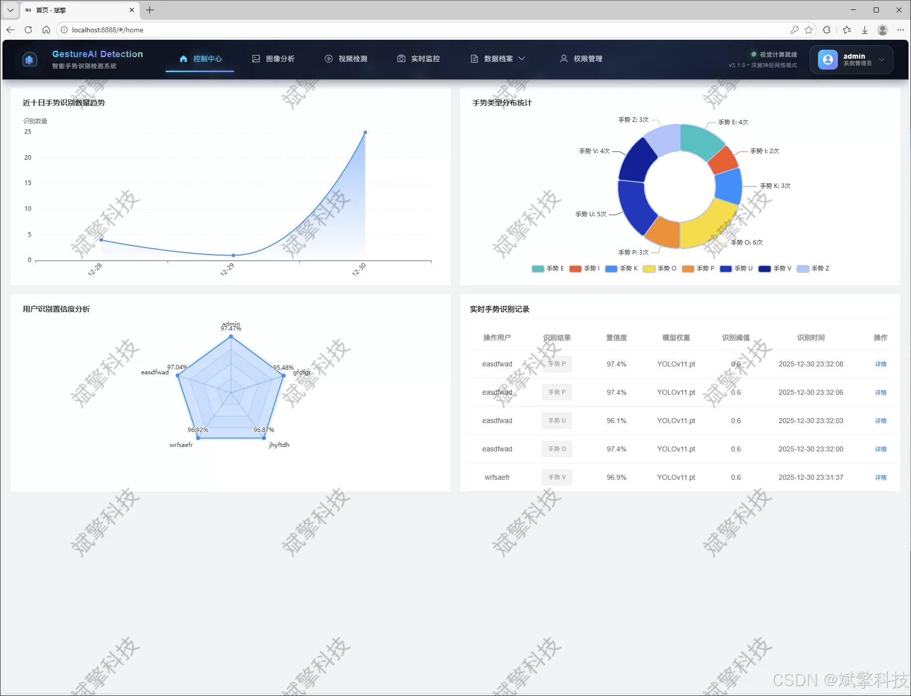
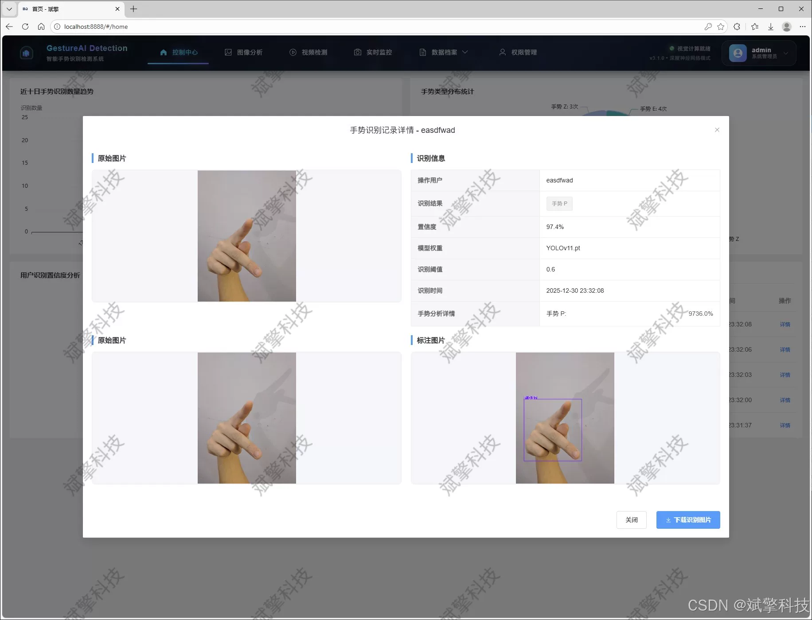
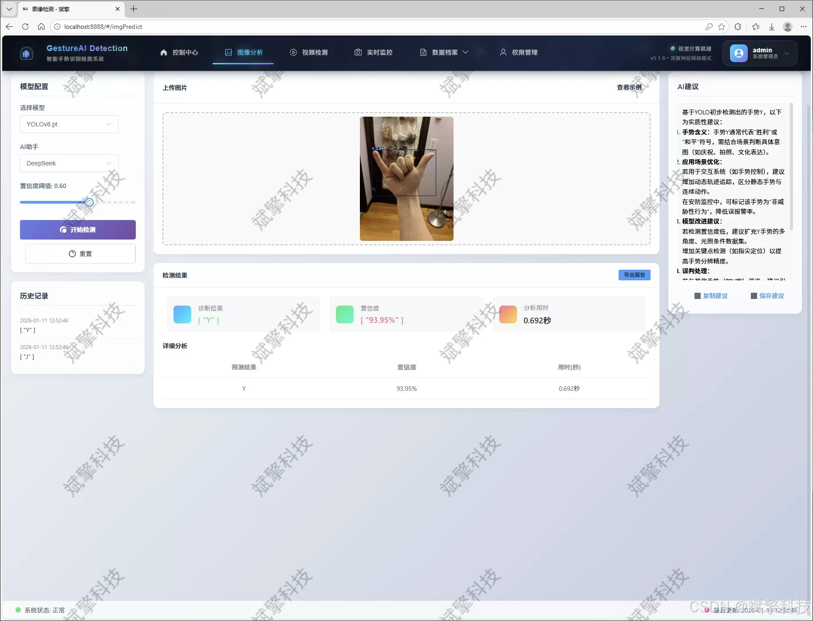
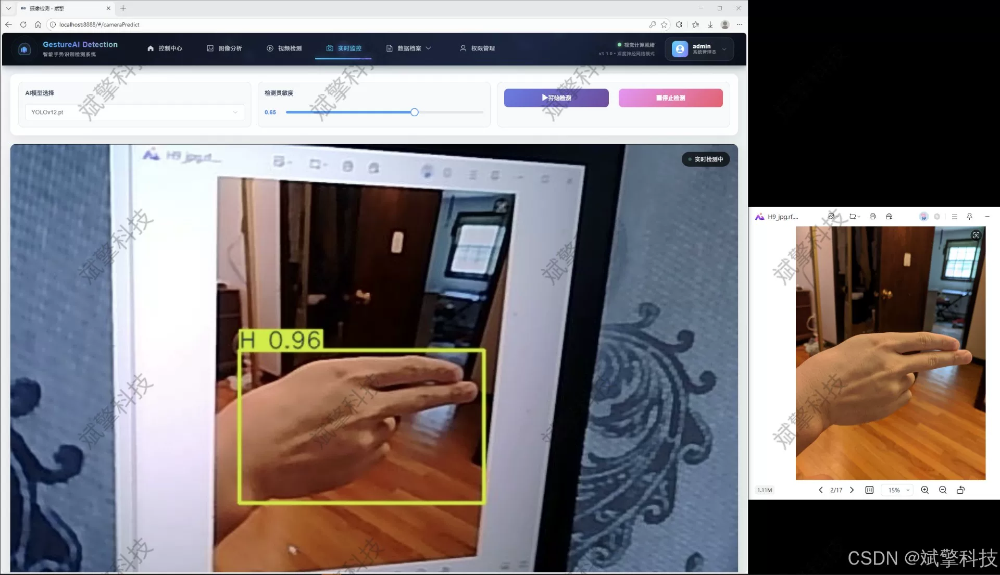
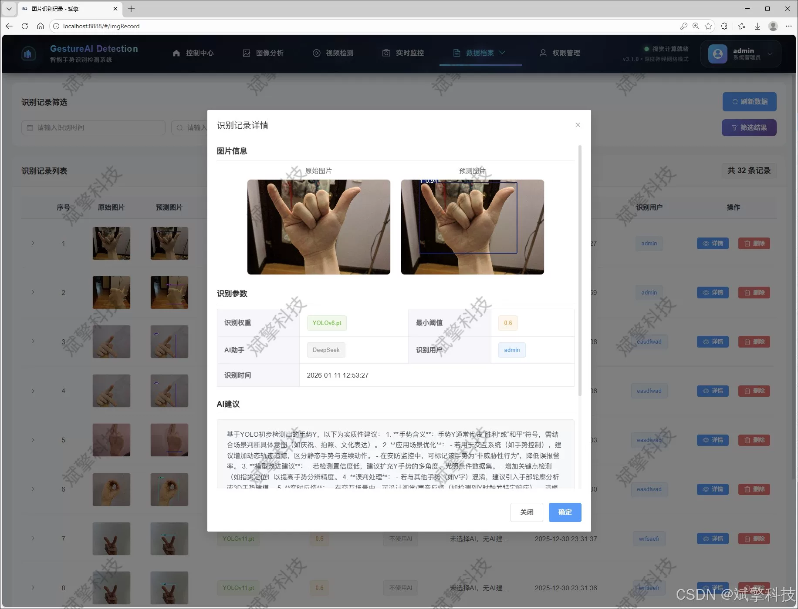
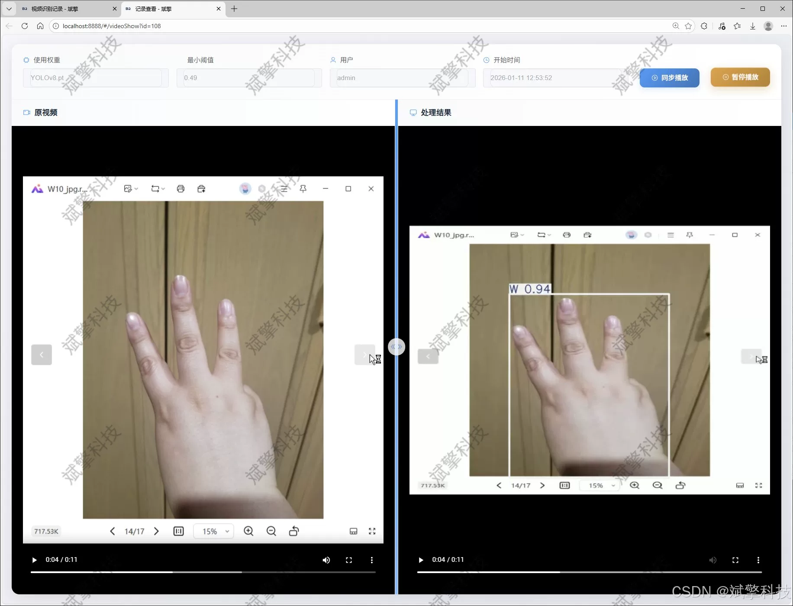
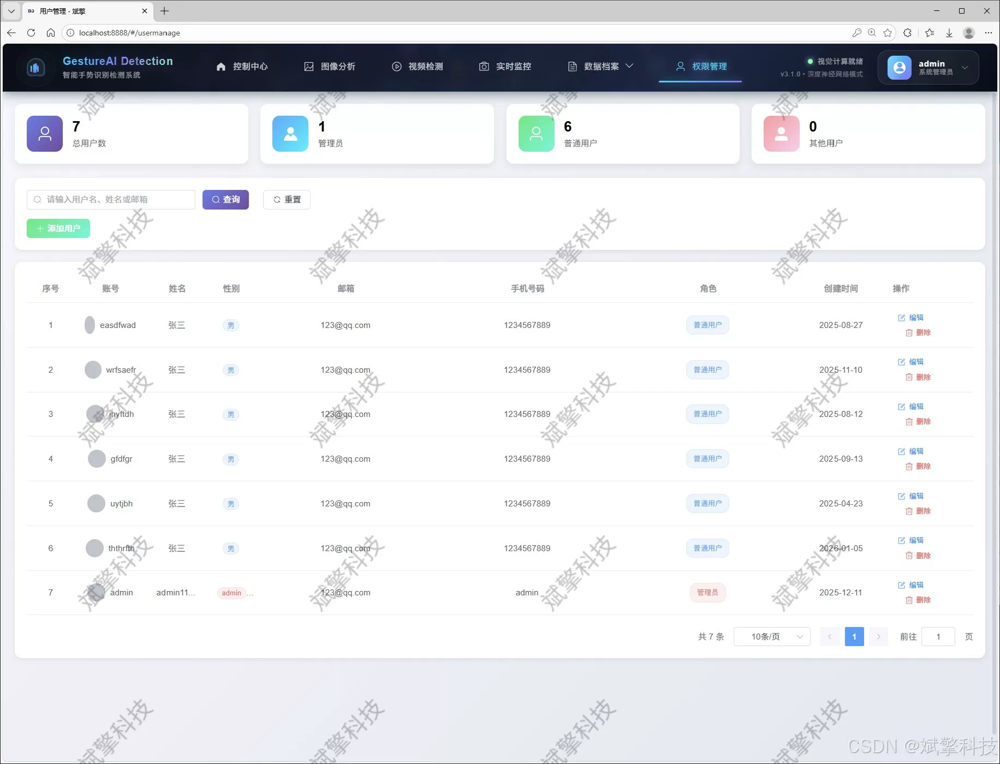
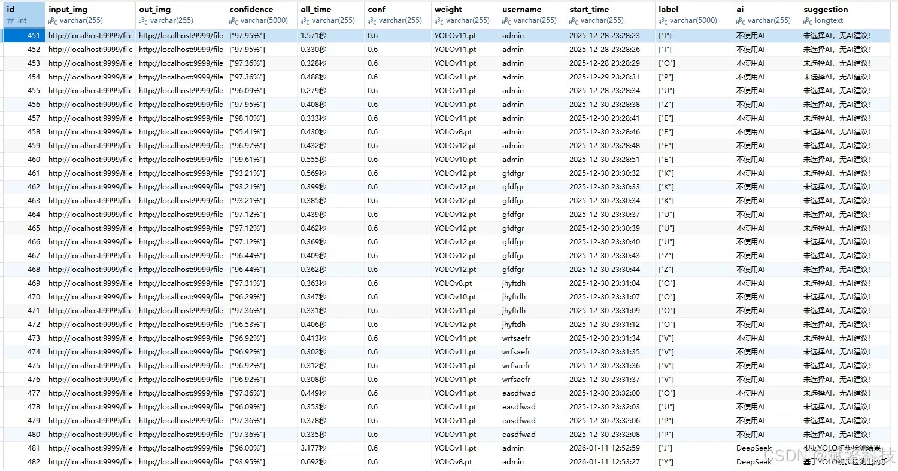

# Based on YOLO deep learning and the large models of Qianwen and DeepSeek for gesture recognition

## Body

Based on YOLO deep learning and the large models of Qianwen, gesture recognition detection system (DeepSeek intelligent analysis + web interface + front-end separation + YOLO data + YOLOv8/YOLOv10/YOLOv11/YOLOv12)

With the rapid development of human-computer interaction technology, gesture recognition, as a natural and intuitive non-contact interaction method, has shown great application potential in human-computer interfaces, intelligent control, and assistive communication fields. This study designed and implemented a set of gesture intelligent recognition system based on deep learning and Web architecture, specifically targeting the high-precision detection and classification of 26 English alphabetic sign gestures. The system innovatively integrates four advanced target detection models: YOLOv8, YOLOv10, YOLOv11, and YOLOv12, building a flexible switching multi-model recognition engine. By constructing a specialized dataset containing 720 high-quality gesture images, a reliable data foundation for accurate recognition of sign language letters was provided. The backend uses SpringBoot microservice framework, combined with a front-end separation architecture, to achieve a complete user management system, multimodal gesture detection, and intelligent analysis functions. A DeepSeek large language model is particularly introduced, providing real-time translation and semantic understanding functions. The system supports image, video, and real-time camera detection modes, and all recognition records are persistently stored in a MySQL database. Experimental results show that the system maintains good recognition performance under different lighting conditions, gesture changes, and complex backgrounds, providing an innovative technical solution for human-computer interaction, assistive communication, and education training fields.

Functional modules

✅ User login registration: Support password verification, saved to MySQL database.

✅ Support four YOLO models switch, YOLOv8, YOLOv10, YOLOv11, YOLOv12.

✅ Information visualization, data visualization.

✅ Image detection support AI analysis function, deepseek and Qianwen.

✅ Support image detection, video detection, and real-time camera detection, detection results saved to MySQL database.

✅ Picture recognition record management, video recognition record management, and camera recognition record management.

✅ User management module, administrator can add, delete, modify, and view users.

✅ Personal center, you can modify your information, password name profile picture and so on.

## Images

## Payment

Here is a pay link on Stripe ( https://buy.stripe.com/3cs8yP7sY87d0vu9AB ). Please contact me lonlonago@foxmail.com after funding $89, and I will send you a complete data files , thank you!

